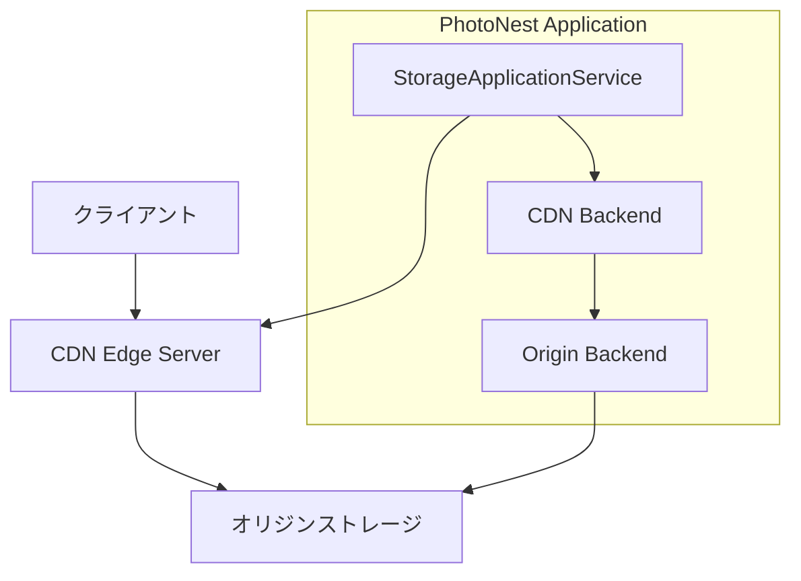

# PhotoNest CDN統合ガイド

PhotoNestの画像・動画配信にCDN（Content Delivery Network）を統合し、グローバルなコンテンツ配信を高速化する機能です。

## 概要

CDN統合により以下の機能が提供されます：

- **高速配信**: 世界中のエッジサーバーからコンテンツを配信
- **セキュアURL**: 時間・IP・地域制限付きのセキュアなアクセス制御
- **キャッシュ制御**: プリフェッチ、パージなどの詳細なキャッシュ管理
- **アナリティクス**: 配信統計、キャッシュヒット率、帯域使用量の監視
- **オリジン統合**: 既存ストレージをオリジンサーバーとして活用

## サポートCDNプロバイダー

| プロバイダー | 対応状況 | 主な特徴 |
|-------------|----------|----------|
| **Azure CDN** | ✅ 完全対応 | セキュアトークン、プリロード、統合アナリティクス |
| **CloudFlare CDN** | ✅ 完全対応 | 高速パージ、地域制限、ゾーンアナリティクス |
| **Generic CDN** | 🔄 基本対応 | 汎用API、カスタマイズ可能 |

## アーキテクチャ



### レイヤー構成

- **Domain Layer**: CDN概念、値オブジェクト、プロトコル定義
- **Infrastructure Layer**: Azure CDN、CloudFlare CDN実装
- **Application Layer**: CDN統合ユースケース
- **Presentation Layer**: API、管理画面

## 設定方法

### 1. Azure CDN設定

```python
from bounded_contexts.storage.domain import *

# Azure CDN認証情報
cdn_credentials = StorageCredentials(
    backend_type=StorageBackendType.AZURE_CDN,
    account_name="your-cdn-account",
    access_key="your-access-key",
    cdn_profile="your-profile-name",
    cdn_endpoint="your-endpoint-name",
)

# オリジンストレージ（Azure Blob）
origin_credentials = StorageCredentials(
    backend_type=StorageBackendType.AZURE_BLOB,
    connection_string="DefaultEndpointsProtocol=https;...",
    container_name="images",
)

# CDN設定
cdn_config = StorageConfiguration(
    backend_type=StorageBackendType.AZURE_CDN,
    credentials=cdn_credentials,
    origin_backend_type=StorageBackendType.AZURE_BLOB,
    origin_credentials=origin_credentials,
    cache_ttl=7200,  # 2時間
    enable_compression=True,
)
```

### 2. CloudFlare CDN設定

```python
# CloudFlare CDN認証情報
cdn_credentials = StorageCredentials(
    backend_type=StorageBackendType.CLOUDFLARE_CDN,
    api_token="your-api-token",
    zone_id="your-zone-id",
    origin_hostname="cdn.example.com",
    access_key="signing-key-for-secure-urls",
)

# オリジンストレージ（ローカル）
origin_credentials = StorageCredentials(
    backend_type=StorageBackendType.LOCAL,
)

cdn_config = StorageConfiguration(
    backend_type=StorageBackendType.CLOUDFLARE_CDN,
    credentials=cdn_credentials,
    origin_backend_type=StorageBackendType.LOCAL,
    origin_credentials=origin_credentials,
    base_path="/var/www/images",
    cache_ttl=3600,  # 1時間
)
```

## 使用例

### CDN URL生成

```python
from bounded_contexts.storage.application import StorageApplicationService

service = StorageApplicationService(repository)
service.configure_storage("photos", cdn_config)

# 画像パス
photo_path = StoragePath(
    domain=StorageDomain.MEDIA,
    intent=StorageIntent.ORIGINAL,
    relative_path="2024/01/30/family.jpg"
)

# CDN URLを取得
cdn_url = service.get_cdn_url("photos", photo_path)
# => "https://your-cdn.azureedge.net/media/original/2024/01/30/family.jpg"
```

### セキュアURL生成

```python
# 時間・IP制限付きURL（1時間有効、特定IPからのみアクセス可能）
secure_url = service.generate_secure_cdn_url(
    "photos",
    photo_path,
    expiration_seconds=3600,
    allowed_ip="203.0.113.100"
)

# 地域制限付きURL（日本からのみアクセス可能）
geo_url = service.generate_secure_cdn_url(
    "photos", 
    photo_path,
    expiration_seconds=1800,
    allowed_countries=["JP"]
)
```

### アップロード＋CDN配信

```python
# 画像をアップロードしてCDNで即座に配信
image_content = open("family.jpg", "rb").read()

metadata = service.upload_and_distribute("photos", photo_path, image_content)

print(f"CDN URL: {metadata.cdn_url}")
print(f"キャッシュ状態: {metadata.cache_status}")
```

### キャッシュ管理

```python
# 特定URLのキャッシュをパージ
purge_job_id = service.purge_cdn_cache(
    "photos",
    [photo_path],
    purge_type="url",
    priority=1  # 高優先度
)

# プレフィックス（フォルダ全体）をパージ
folder_path = StoragePath(
    domain=StorageDomain.MEDIA,
    intent=StorageIntent.ORIGINAL,
    relative_path="2024/01/"
)

service.purge_cdn_cache("photos", [folder_path], purge_type="prefix")

# 人気コンテンツをプリフェッチ
popular_paths = [...]
service.prefetch_to_cdn("photos", popular_paths)
```

### アナリティクス取得

```python
# 特定期間のアナリティクスを取得
analytics = service.get_cdn_analytics(
    "photos",
    folder_path,
    start_time="2024-01-30T00:00:00Z",
    end_time="2024-01-30T23:59:59Z"
)

for record in analytics:
    print(f"パス: {record.path}")
    print(f"リクエスト数: {record.requests_count:,}")
    print(f"転送量: {record.bandwidth_bytes / 1024 / 1024:.1f} MB")
    print(f"キャッシュヒット率: {record.cache_hit_ratio:.2%}")
```

## パフォーマンス最適化

### キャッシュ戦略

```python
# 長期キャッシュ（静的画像）
static_config = StorageConfiguration(
    ...,
    cache_ttl=86400,  # 24時間
    enable_compression=True,
)

# 短期キャッシュ（動的コンテンツ）
dynamic_config = StorageConfiguration(
    ...,
    cache_ttl=300,  # 5分
    enable_compression=False,
)
```

### プリフェッチ戦略

```python
# 人気コンテンツの定期プリフェッチ
def prefetch_popular_content():
    popular_photos = get_trending_photos(limit=100)
    paths = [photo.to_storage_path() for photo in popular_photos]
    service.prefetch_to_cdn("photos", paths)

# Celeryタスクとして定期実行
from celery import Celery
app = Celery()

@app.task
def scheduled_prefetch():
    prefetch_popular_content()
```

## エラーハンドリング

### CDN API エラー

```python
try:
    cdn_url = service.get_cdn_url("photos", photo_path)
except RuntimeError as e:
    if "authentication failed" in str(e):
        # CDN認証エラー → ログ出力、オリジンURLにフォールバック
        logger.error(f"CDN authentication failed: {e}")
        fallback_url = service.get_download_url("photos", photo_path)
    elif "rate limit" in str(e):
        # レート制限 → 再試行ロジック
        time.sleep(60)
        cdn_url = service.get_cdn_url("photos", photo_path)
    else:
        raise
```

### フォールバック動作

```python
# CDN非対応バックエンドでの自動フォールバック
def get_optimized_url(domain: str, path: StoragePath) -> str:
    try:
        # まずCDN URLを試行
        return service.get_cdn_url(domain, path)
    except Exception:
        # CDNが利用できない場合は通常のダウンロードURL
        return service.get_download_url(domain, path)
```

## 監視・運用

### アナリティクス監視

```python
def monitor_cdn_performance():
    """CDN性能監視."""
    analytics = service.get_cdn_analytics(
        "photos",
        StoragePath("*", "*", ""),
        start_time=yesterday(),
        end_time=now()
    )
    
    total_requests = sum(a.requests_count for a in analytics)
    avg_hit_ratio = sum(a.cache_hit_ratio for a in analytics) / len(analytics)
    total_bandwidth = sum(a.bandwidth_bytes for a in analytics)
    
    # アラートしきい値チェック
    if avg_hit_ratio < 0.8:
        send_alert("CDN cache hit ratio is low", avg_hit_ratio)
    
    if total_bandwidth > BANDWIDTH_THRESHOLD:
        send_alert("CDN bandwidth usage is high", total_bandwidth)
```

### ログ監視

```python
import logging

cdn_logger = logging.getLogger("photonest.cdn")

# CDN API呼び出しログ
cdn_logger.info("CDN purge requested", extra={
    "domain": domain,
    "paths": paths,
    "purge_type": purge_type,
    "job_id": job_id
})

# CDNエラーログ
cdn_logger.error("CDN operation failed", extra={
    "error": str(e),
    "domain": domain,
    "operation": "get_cdn_url"
})
```

## テスト

### ユニットテスト

```bash
# CDN実装のユニットテスト
pytest tests/unit/storage/test_azure_cdn.py
pytest tests/unit/storage/test_cloudflare_cdn.py
pytest tests/unit/storage/test_cdn_validation.py
```

### 統合テスト

```bash
# CDN統合テスト（モック使用）
pytest tests/integration/storage/test_cdn_integration.py
```

### デモ実行

```bash
# CDN統合デモプログラム
python scripts/demo_cdn_integration.py
```

## トラブルシューティング

### よくある問題

#### 1. CDN認証エラー

**症状**: `RuntimeError: CDN authentication failed`

**原因**: API トークンやアクセスキーが無効

**解決策**:
- CDNプロバイダーのコンソールでAPIキーを確認
- 権限スコープが適切に設定されているか確認

#### 2. オリジンストレージ接続エラー

**症状**: `ConnectionError: Failed to connect to origin storage`

**原因**: オリジンストレージの認証情報が無効

**解決策**:
- オリジンストレージの接続設定を確認
- ネットワークアクセス許可を確認

#### 3. キャッシュパージが反映されない

**症状**: パージ後も古いコンテンツが配信される

**原因**: CDN エッジサーバーの伝播遅延

**解決策**:
- パージジョブのステータスを確認
- グローバル伝播まで最大15分待機

## パフォーマンス指標

### 推奨値

| 指標 | 推奨値 | 説明 |
|------|--------|------|
| キャッシュヒット率 | > 85% | CDN効果の指標 |
| 平均レスポンス時間 | < 100ms | エッジサーバー応答時間 |
| 帯域使用効率 | > 70% | キャッシュによる帯域節約 |
| パージ完了時間 | < 5分 | 緊急更新への対応力 |

### 最適化指針

1. **適切なキャッシュTTL設定**
   - 静的コンテンツ: 24時間〜7日
   - 動的コンテンツ: 5分〜1時間

2. **効果的なプリフェッチ**
   - アクセス予測に基づく事前キャッシュ
   - ピーク時間前の準備

3. **戦略的パージ**
   - 必要最小限のパージ範囲
   - 優先度による制御

## セキュリティ考慮事項

### アクセス制御

- **セキュアURL**: 時間制限、IP制限、地域制限
- **署名トークン**: HMAC-SHA256による改ざん防止
- **リファラー制限**: 特定ドメインからのアクセスのみ許可

### 機密情報保護

- **API認証情報**: 環境変数、シークレット管理
- **ログ出力**: 認証情報のマスキング
- **監査ログ**: CDN操作の完全な記録

---

PhotoNest CDN統合により、グローバルな画像・動画配信が高速化され、ユーザー体験が大幅に向上します。