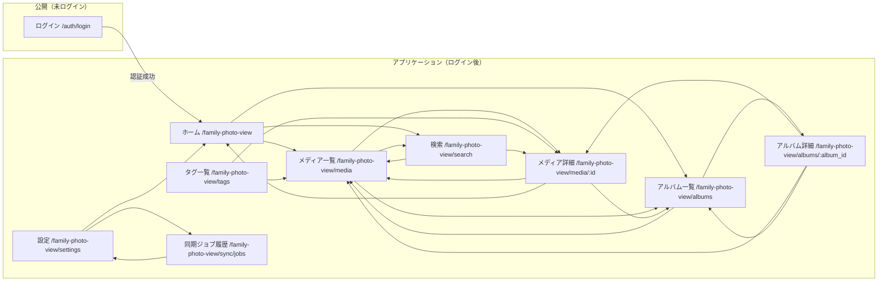
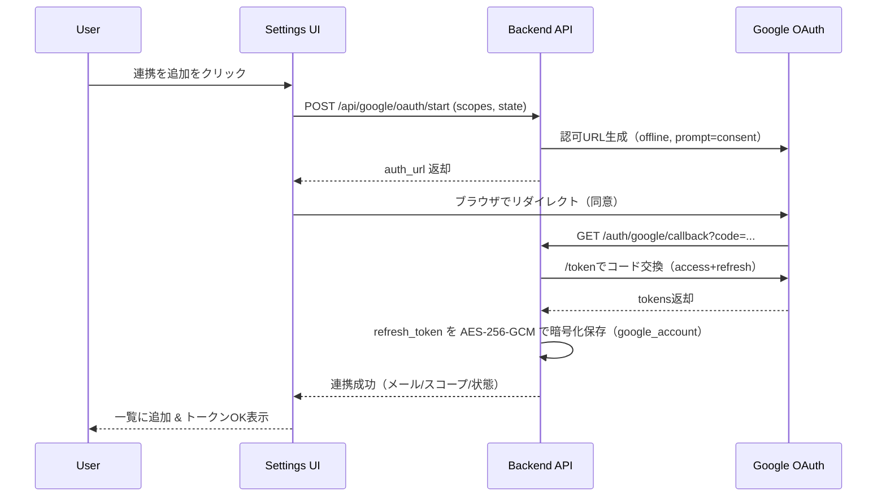

# 家族向けフォトビューア 要件定義 v1.0

作成日: 2025-08-12 / 作成者: ChatGPT（下書き）

---

## 1. 目的・ゴール

* **目的**: 家族が自宅LAN内で快適に写真・動画を閲覧できること。
* **ゴール**:

  * Google Photos（複数アカウント）と既存ローカルフォルダのメディアを **NAS に統合**。
  * ブラウザから高速に閲覧・検索・アルバム整理ができる。
  * 動画は互換性の高い **再生用MP4** を自動生成し、快適に再生できる。

## 2. スコープ

* 対象データ: 写真、動画、Live Photos / Motion Photos（一覧は1件として扱い、詳細で動画再生）
* 同期対象: Google Photos API（差分）＋ 既存ローカルフォルダ（固定パス）
* 保存先: Synology NAS（SMBマウント）

  * 原本: `/mnt/nas/photos/originals/YYYY/MM/DD/`
  * 再生用: `/mnt/nas/photos/playback/YYYY/MM/DD/`
  * サムネ: `/mnt/nas/photos/thumbs/{256|1024|2048}/`
* 利用者: 家族数人（ID/パスワード）
* 範囲外: 外部共有リンク（将来拡張）

## 3. 非機能要件

* **性能**:

  * グリッド表示 初回応答 < 300ms（サムネキャッシュ利用）
  * 1ページ 200件程度の無限スクロール
* **可用性**: 再生用生成前でも原本ダウンロードは可能（MVP救済）
* **セキュリティ**: LAN内前提、家族アカウント認証、CSRF対策、Cookie SameSite=Lax
* **バックアップ**: DB・設定を毎日スナップショット。原本はNASのレプリケーションに委譲。
* **運用**: 変換失敗件数・キュー滞留・ディスク空きの監視（通知先は今後決定）

## 4. システム構成

* Web: Python（Flask/FastAPIいずれか） + フロントはFetch APIで非同期描画
* DB: MariaDB 10.11
* バッチ: cron起動の同期バッチ（毎日 02:00）＋ 変換ワーカー（常駐 or cron）
* 画像処理: 取り込み後にサムネ生成（256/1024/2048）
* 動画変換: **全動画 事前変換（C案）** → 再生用 `MP4(H.264/AAC, 1080p, CRF20, faststart)`

## 5. 同期・取り込み設計

### 5.1 Google Photos（差分）

* 複数アカウント対応（`google_account` 管理）。
* 取得順序: メタ→ダウンロード→ハッシュ→重複判定→正規名リネーム→配置→DB登録。
* レジューム: `job_sync` に pageToken/進捗を保存、失敗時は再開。
* 削除反映: Google側削除は **`media.is_deleted=1`** として非表示扱い。実ファイルは残す。

### 5.2 既存ローカル取り込み

* 固定ディレクトリを走査。取り込んだファイルは **削除**（成功時）
* リネーム規則: `YYYYMMDD_HHMMSS_src_hash8.ext`（`src`=gphotos/local/cam）
* 重複判定: `SHA-256` + `サイズ` 一致でスキップ。

## 6. Live/Motion Photos 取り扱い

* 表示は1エンティティ（`media`）として束ね、関連ファイル（MOV/MP4/XMP/JSON）は `media_sidecar` へ。
* 詳細ビューで動画再生（再生用MP4が用意できるまで「処理中」表示）。

## 7. 動画変換（C案：原本＋再生用2本持ち）

* 変換プロファイル（初期値）:

  * 映像: H.264(libx264) / **最大1080p**（元が低ければ据え置き） / **CRF 20** / `-preset medium` / `-g 48`
  * 音声: AAC 128kbps
  * コンテナ: MP4、`-movflags +faststart`
* ポスター: 1秒時点から1枚 JPG 抽出。
* ワーカー: キューから未変換動画を取得 → 一時出力 → 検証（長さ±1%/ストリーム有）→ playbackへ移動 → `media_playback.status=success`。
* 並列度: **2並列**。

## 8. 画面要件（ワイヤー）

1. ホーム: 最近追加 / タイムライン（月別ヘッダ＋無限スクロール）
2. アルバム一覧: グリッド、作成/改名/削除、表紙設定
3. メディア一覧: 期間・タグ・種別（写真/動画）でファセット
4. 詳細: 原寸/ズーム、EXIF、関連動画再生、アルバム追加、タグ編集
5. 検索: キーワード（タイトル/タグ）、期間、種別
6. 設定: Google連携（複数）、NASパス、変換/サムネ設定、同期ステータス

### 9. API（主要エンドポイント案）

* `GET /api/media?query=&from=&to=&type=&tag=&album=&page=&pageSize=&cursor=&order=`

  * **query**: タイトル・タグ等の全文検索キーワード（詳細は9.3参照）
  * **from/to**: 撮影日時範囲（RFC 3339, UTC）
  * **type**: `photo` | `video` | `all`（既定）
  * **tag**: タグ名（複数指定可）
  * **album**: アルバムID（複数指定可）
  * **page/pageSize**: ページネーション用（既定page=1, pageSize=200, 上限500）
  * **cursor**: 無限スクロール用のカーソル（`shot_at`＋`id`をBase64URLエンコード）
  * **order**: `desc`（既定） | `asc`
  * レスポンスに`next_cursor`/`prev_cursor`を含める
* `GET /api/media/{id}` → {meta, exif, sidecars, playback( url,width,height,status,poster )}
* `GET /api/media/{id}/thumb?size=256|1024|2048`
* `POST /api/albums` / `PATCH /api/albums/{id}` / `DELETE /api/albums/{id}`
* `POST /api/albums/{id}/items`（追加・並び替え）
* `GET/POST /api/tags`、`POST /api/media/{id}/tags`
* `GET /api/sync/jobs`（履歴/進捗）、`POST /api/sync/trigger`（手動実行）
* `POST /api/auth/login` / `POST /api/auth/logout` / `GET /api/me`

### 9.1 レスポンス例（抜粋）

※ すべてのAPIレスポンスに **`server_time`**（RFC 3339, UTC）を含める。あわせてHTTPヘッダ `X-Server-Time` に同値を返す。

**一覧取得（ページネーション＋無限スクロール両対応）**

```json
{
  "server_time": "2025-08-12T04:44:55Z",
  "page": 3,
  "page_size": 200,
  "next_cursor": "eyJzaG90X2F0IjoiMjAyNS0wOC0xMlQxMDoyMDo1NVoiLCJpZCI6MTIzNDU2fQ==",
  "prev_cursor": "eyJzaG90X2F0IjoiMjAyNS0wOC0xMlQxMDoxNTo1NVoiLCJpZCI6MTE5OTk5fQ==",
  "items": [
    {
      "id": 123,
      "shot_at": "2025-08-12T10:44:55Z",
      "mime_type": "image/jpeg",
      "is_video": false,
      "thumbs": {"256": "/t/256/2025/08/12/a1b2.jpg"},
      "albums": [1,2],
      "tags": ["kids","summer"],
      "playback": null
    }
  ]
}
```

**単一メディア（写真）**

```json
{
  "server_time": "2025-08-12T04:44:55Z",
  "id": 123,
  "shot_at": "2025-08-12T10:44:55Z",
  "mime_type": "image/jpeg",
  "is_video": false,
  "thumbs": {"256": "/t/256/2025/08/12/a1b2.jpg", "1024": "/t/1024/2025/08/12/a1b2.jpg"},
  "albums": [1,2],
  "tags": ["kids","summer"],
  "playback": null
}
```

**単一メディア（動画：再生用あり）**

```json
{
  "server_time": "2025-08-12T04:44:55Z",
  "id": 456,
  "shot_at": "2025-08-12T10:44:55Z",
  "mime_type": "video/quicktime",
  "is_video": true,
  "thumbs": {"256": "/t/256/2025/08/12/c9d8.jpg", "1024": "/t/1024/2025/08/12/c9d8.jpg"},
  "playback": {
    "status": "success",
    "url": "/p/2025/08/12/20250812_104455_gphotos_a1b2c3d4_play.mp4",
    "width": 1920,
    "height": 1080,
    "poster": "/t/1024/2025/08/12/c9d8.jpg"
  }
}
```

### 9.2 クエリ例（/api/media）

| パラメータ      | 型 / 形式          | 例                      | 仕様・挙動                                                            |
| ---------- | --------------- | ---------------------- | ---------------------------------------------------------------- |
| `query`    | string（部分一致）    | `kids summer`          | スペース区切りAND。対象は当面 `tag.name`（将来 `media.title` 等に拡張）。大文字小文字は区別しない。 |
| `from`     | RFC3339 UTC     | `2024-01-01T00:00:00Z` | `shot_at >= from`（**含む**）。`shot_at` が NULL の行は除外。                |
| `to`       | RFC3339 UTC     | `2025-12-31T23:59:59Z` | `shot_at <= to`（**含む**）。                                         |
| `type`     | enum            | `photo` / `video`      | `is_video=0/1` で絞り込み。省略時は両方。                                     |
| `tag`      | string or array | `?tag=kids&tag=trip`   | 複数指定可。既定=OR。`match=all` 指定で AND。                                 |
| `album`    | number or array | `?album=12&album=34`   | 複数指定可。既定=OR。`match=all` 指定で AND。                                 |
| `order`    | enum            | `desc`（既定）/ `asc`      | ソート方向。主キーは `shot_at` → `id`。                                     |
| `page`     | int (1〜)        | `page=1`               | ページネーション。`cursor` 指定時は無視。                                        |
| `pageSize` | int             | `pageSize=200`         | 既定=200、最大=500。                                                   |
| `cursor`   | base64url(JSON) | `eyJzaG90X2F0Ijoi...`  | 無限スクロール用。指定時は `page/pageSize` を無視。                               |

**注意事項**

* 全レスポンスに `server_time`（RFC 3339, UTC）を含め、HTTPヘッダ `X-Server-Time` でも返却。
* `from`/`to` は UTC 前提。ローカル表示はフロントで変換。
* タグ/アルバムの AND 絞り込みは結合回数が増えるため、インデックス最適化必須。
* `query` は将来的に全文検索エンジンへ差し替え可能な設計とする。

### 9.3 フィルタ項目定義（/api/media）

| パラメータ      | 型 / 形式          | 例                      | 仕様・挙動                                                                 |
| ---------- | --------------- | ---------------------- | --------------------------------------------------------------------- |
| `query`    | string（部分一致）    | `kids summer`          | スペース区切り **AND**。対象は当面 `tag.name`（将来 `media.title` 等に拡張）。大文字小文字は区別しない。 |
| `from`     | RFC3339 UTC     | `2024-01-01T00:00:00Z` | `shot_at >= from`（**含む**）。`shot_at` が NULL の行は除外。                     |
| `to`       | RFC3339 UTC     | `2025-12-31T23:59:59Z` | `shot_at <= to`（**含む**）。                                              |
| `type`     | enum            | `photo` / `video`      | `is_video=0/1` で絞り込み。省略時は両方。                                          |
| `tag`      | string or array | `?tag=kids&tag=trip`   | 複数指定可。既定= **OR**。`match=all` 指定で **AND**。                             |
| `album`    | number or array | `?album=12&album=34`   | 複数指定可。既定= **OR**。`match=all` 指定で **AND**。                             |
| `order`    | enum            | `desc`（既定）/ `asc`      | ソート方向。主キーは `shot_at` → `id` の2キー。                                     |
| `page`     | int (1〜)        | `page=1`               | ページネーション。`cursor` 指定時は無視。                                             |
| `pageSize` | int             | `pageSize=200`         | 既定=200、最大=500。                                                        |
| `cursor`   | base64url(JSON) | `eyJzaG90X2F0Ijoi...`  | 無限スクロール用。指定時は `page/pageSize` を無視。                                    |

**注意事項**

* すべてのレスポンスに `server_time`（RFC3339 UTC）を含め、ヘッダ `X-Server-Time` にも同値を返す。
* `from`/`to` は **UTC** 前提（格納も UTC）。ローカル表示はフロントで変換。
* `query` は将来的に全文検索（Meilisearch/FTS等）へ差し替え可能な抽象API。
* タグ/アルバムの AND 絞り込みは結合回数が増えるため、インデックス（`media_tag(tag_id, media_id)`, `album_item(album_id, sort_index)`）を前提。

## 10. DB 設計（MariaDB 10.11）

* 文字コード: `utf8mb4`
* 時刻は **UTC** 基準で格納（表示時にローカル適用）

```sql
-- media: 原本の主テーブル
CREATE TABLE media (
  id BIGINT PRIMARY KEY AUTO_INCREMENT,
  google_media_id VARCHAR(191) NULL UNIQUE,
  account_id BIGINT NULL,
  local_rel_path VARCHAR(500) NOT NULL,
  hash_sha256 CHAR(64) NOT NULL UNIQUE,
  bytes BIGINT NOT NULL,
  mime_type VARCHAR(100) NOT NULL,
  width INT NULL,
  height INT NULL,
  duration_ms INT NULL,
  shot_at DATETIME NULL,
  imported_at DATETIME NOT NULL,
  orientation TINYINT NULL,
  is_video TINYINT(1) NOT NULL DEFAULT 0,
  live_group_id BIGINT NULL,
  is_deleted TINYINT(1) NOT NULL DEFAULT 0,
  has_playback TINYINT(1) NOT NULL DEFAULT 0,
  INDEX idx_media_shot (shot_at),
  INDEX idx_media_account (account_id),
  INDEX idx_media_live (live_group_id),
  CONSTRAINT fk_media_account FOREIGN KEY (account_id) REFERENCES google_account(id)
) ENGINE=InnoDB DEFAULT CHARSET=utf8mb4;

-- Live/MotionやXMPなど副次ファイル
CREATE TABLE media_sidecar (
  id BIGINT PRIMARY KEY AUTO_INCREMENT,
  media_id BIGINT NOT NULL,
  type ENUM('jpeg','mov','mp4','xmp','json','sidecar') NOT NULL,
  rel_path VARCHAR(500) NOT NULL,
  bytes BIGINT NOT NULL,
  UNIQUE KEY uq_sidecar_media_type (media_id, type),
  INDEX idx_sidecar_media (media_id),
  CONSTRAINT fk_sidecar_media FOREIGN KEY (media_id) REFERENCES media(id)
) ENGINE=InnoDB DEFAULT CHARSET=utf8mb4;

-- EXIF 正規化
CREATE TABLE exif (
  media_id BIGINT PRIMARY KEY,
  camera_make VARCHAR(100) NULL,
  camera_model VARCHAR(100) NULL,
  lens VARCHAR(100) NULL,
  iso INT NULL,
  shutter VARCHAR(50) NULL,
  f_number DECIMAL(4,1) NULL,
  focal_len DECIMAL(5,1) NULL,
  gps_lat DECIMAL(10,7) NULL,
  gps_lng DECIMAL(10,7) NULL,
  raw_json LONGTEXT NULL,
  CONSTRAINT fk_exif_media FOREIGN KEY (media_id) REFERENCES media(id)
) ENGINE=InnoDB DEFAULT CHARSET=utf8mb4;

-- ローカル独自アルバム
CREATE TABLE album (
  id BIGINT PRIMARY KEY AUTO_INCREMENT,
  name VARCHAR(200) NOT NULL,
  description TEXT NULL,
  cover_media_id BIGINT NULL,
  visibility ENUM('private','family') NOT NULL DEFAULT 'family',
  created_at DATETIME NOT NULL,
  updated_at DATETIME NOT NULL,
  UNIQUE KEY uq_album_name (name),
  INDEX idx_album_cover (cover_media_id),
  CONSTRAINT fk_album_cover FOREIGN KEY (cover_media_id) REFERENCES media(id)
) ENGINE=InnoDB DEFAULT CHARSET=utf8mb4;

CREATE TABLE album_item (
  album_id BIGINT NOT NULL,
  media_id BIGINT NOT NULL,
  sort_index BIGINT NOT NULL,
  PRIMARY KEY (album_id, media_id),
  INDEX idx_albumitem_sort (album_id, sort_index),
  CONSTRAINT fk_albumitem_album FOREIGN KEY (album_id) REFERENCES album(id),
  CONSTRAINT fk_albumitem_media FOREIGN KEY (media_id) REFERENCES media(id)
) ENGINE=InnoDB DEFAULT CHARSET=utf8mb4;

-- タグ（自由/人物/場所/イベントなど属性で拡張可能）
CREATE TABLE tag (
  id BIGINT PRIMARY KEY AUTO_INCREMENT,
  name VARCHAR(100) NOT NULL,
  attr ENUM('free','person','place','event') NOT NULL DEFAULT 'free',
  UNIQUE KEY uq_tag_name_attr (name, attr)
) ENGINE=InnoDB DEFAULT CHARSET=utf8mb4;

CREATE TABLE media_tag (
  media_id BIGINT NOT NULL,
  tag_id BIGINT NOT NULL,
  PRIMARY KEY (media_id, tag_id),
  INDEX idx_mediatag_tag (tag_id, media_id),
  CONSTRAINT fk_mediatag_media FOREIGN KEY (media_id) REFERENCES media(id),
  CONSTRAINT fk_mediatag_tag FOREIGN KEY (tag_id) REFERENCES tag(id)
) ENGINE=InnoDB DEFAULT CHARSET=utf8mb4;

-- 家族ユーザー
CREATE TABLE user (
  id BIGINT PRIMARY KEY AUTO_INCREMENT,
  email VARCHAR(191) NOT NULL UNIQUE,
  display_name VARCHAR(100) NOT NULL,
  password_hash VARCHAR(255) NOT NULL,
  role ENUM('admin','viewer') NOT NULL DEFAULT 'viewer',
  created_at DATETIME NOT NULL
) ENGINE=InnoDB DEFAULT CHARSET=utf8mb4;

-- Googleアカウント（複数対応）
CREATE TABLE google_account (
  id BIGINT PRIMARY KEY AUTO_INCREMENT,
  email VARCHAR(191) NOT NULL UNIQUE,
  oauth_token_json LONGTEXT NOT NULL,
  status ENUM('active','disabled') NOT NULL DEFAULT 'active',
  last_synced_at DATETIME NULL
) ENGINE=InnoDB DEFAULT CHARSET=utf8mb4;

-- 同期・変換ジョブ
CREATE TABLE job_sync (
  id BIGINT PRIMARY KEY AUTO_INCREMENT,
  target ENUM('google_photos','local_import','transcode') NOT NULL,
  account_id BIGINT NULL,
  started_at DATETIME NOT NULL,
  finished_at DATETIME NULL,
  status ENUM('running','success','failed','partial') NOT NULL,
  stats_json LONGTEXT NULL,
  INDEX idx_jobs_time (started_at),
  CONSTRAINT fk_jobs_account FOREIGN KEY (account_id) REFERENCES google_account(id)
) ENGINE=InnoDB DEFAULT CHARSET=utf8mb4;

-- 再生用ファイル（プロファイル拡張を見据えて独立）
CREATE TABLE media_playback (
  id BIGINT PRIMARY KEY AUTO_INCREMENT,
  media_id BIGINT NOT NULL,
  preset ENUM('std1080p') NOT NULL,
  rel_path VARCHAR(500) NOT NULL,
  width INT NULL,
  height INT NULL,
  v_codec VARCHAR(20) NULL,
  a_codec VARCHAR(20) NULL,
  v_bitrate_kbps INT NULL,
  duration_ms INT NULL,
  poster_rel_path VARCHAR(500) NULL,
  hash_sha256 CHAR(64) NULL,
  status ENUM('queued','running','success','failed','skipped') NOT NULL,
  error_msg TEXT NULL,
  created_at DATETIME NOT NULL,
  updated_at DATETIME NOT NULL,
  UNIQUE KEY uq_playback_media_preset (media_id, preset),
  INDEX idx_play_media (media_id, status),
  CONSTRAINT fk_playback_media FOREIGN KEY (media_id) REFERENCES media(id)
) ENGINE=InnoDB DEFAULT CHARSET=utf8mb4;
```

## 11. ディレクトリ/ファイル命名

* 原本: `originals/YYYY/MM/DD/20250812_104455_gphotos_a1b2c3d4.jpg`
* 再生用: `playback/YYYY/MM/DD/20250812_104455_gphotos_a1b2c3d4_play.mp4`
* サムネ: `thumbs/{256|1024|2048}/YYYY/MM/DD/xxxx.jpg`
* 一時: `tmp/…`（生成→検証→アトミック移動）

## 12. バッチ/ワーカー

* `02:00`: Google差分 → メディア配置/登録 → **動画を変換キューへ投入**
* ワーカー: キューを2並列で処理、失敗は最大3回リトライ。
* 監視: 失敗>0、滞留>閾値、空き容量<閾値 で通知。

## 13. セキュリティ/プライバシー

* 家族アカウント（PBKDF2/Argon2）
* Googleトークンは暗号化保管（OS KMS/鍵ファイル）
* 位置情報の表示ON/OFF設定（UIから切替）

## 14. 受け入れ条件（抜粋）

* Google複数アカウントからの差分取得が動作する。
* 既存ローカル取り込みが動作し、取り込み後に元フォルダから削除される。
* すべての動画で再生用MP4が生成され、ブラウザで再生できる（1080p, faststart）。
* タイムライン/アルバム/タグの基本操作が可能。
* 削除反映は `is_deleted=1` で非表示（物理削除なし）。

## 15. ER 図（Mermaid）

```mermaid
erDiagram
  google_account ||--o{ media : has
  media ||--o{ media_sidecar : has
  media ||--|| exif : has
  album ||--o{ album_item : has
  media ||--o{ album_item : in
  media ||--o{ media_tag : tagged
  tag ||--o{ media_tag : used
  media ||--o{ media_playback : has

  google_account {
    BIGINT id PK
    VARCHAR email
    LONGTEXT oauth_token_json
    ENUM status
    DATETIME last_synced_at
  }
  media {
    BIGINT id PK
    VARCHAR google_media_id
    BIGINT account_id FK
    VARCHAR local_rel_path
    CHAR hash_sha256
    BIGINT bytes
    VARCHAR mime_type
    INT width
    INT height
    INT duration_ms
    DATETIME shot_at
    DATETIME imported_at
    TINYINT orientation
    TINYINT is_video
    BIGINT live_group_id
    TINYINT is_deleted
    TINYINT has_playback
  }
  media_sidecar {
    BIGINT id PK
    BIGINT media_id FK
    ENUM type
    VARCHAR rel_path
    BIGINT bytes
  }
  exif {
    BIGINT media_id PK FK
    VARCHAR camera_make
    VARCHAR camera_model
    VARCHAR lens
    INT iso
    VARCHAR shutter
    DECIMAL f_number
    DECIMAL focal_len
    DECIMAL gps_lat
    DECIMAL gps_lng
    LONGTEXT raw_json
  }
  album {
    BIGINT id PK
    VARCHAR name
    TEXT description
    BIGINT cover_media_id FK
    ENUM visibility
    DATETIME created_at
    DATETIME updated_at
  }
  album_item {
    BIGINT album_id PK FK
    BIGINT media_id PK FK
    BIGINT sort_index
  }
  tag {
    BIGINT id PK
    VARCHAR name
    ENUM attr
  }
  media_tag {
    BIGINT media_id PK FK
    BIGINT tag_id PK FK
  }
  media_playback {
    BIGINT id PK
    BIGINT media_id FK
    ENUM preset
    VARCHAR rel_path
    INT width
    INT height
    VARCHAR v_codec
    VARCHAR a_codec
    INT v_bitrate_kbps
    INT duration_ms
    VARCHAR poster_rel_path
    CHAR hash_sha256
    ENUM status
    TEXT error_msg
    DATETIME created_at
    DATETIME updated_at
  }
```

### 16. 画面設計（一覧とパス）

| 画面名                | パス                   | 概要                               | 主な機能                                 |
| ------------------ | -------------------- | -------------------------------- | ------------------------------------ |
| ホーム（最近追加 / タイムライン） | `/photo-viewer`                  | 最近追加メディアの一覧と月別タイムライン表示           | 最近追加一覧、月別ヘッダ、無限スクロール、メディア詳細遷移        |
| アルバム一覧             | `/photo-viewer/albums`            | 登録済みアルバムのグリッド表示                  | アルバム作成・改名・削除、表紙設定、アルバム詳細遷移           |
| アルバム詳細             | `/photo-viewer/albums/{album_id}` | アルバム内メディア一覧                      | メディア並び替え、追加・削除、無限スクロール               |
| メディア一覧（全件/検索結果）    | `/photo-viewer/media`             | タグ、期間、種別などの条件検索結果一覧              | フィルタ、ソート、無限スクロール、メディア詳細遷移            |
| メディア詳細（写真/動画）      | `/photo-viewer/media/{id}`        | メディア原寸表示、再生用動画再生、EXIF・タグ表示       | 再生/ズーム、タグ追加・削除、アルバム追加、ダウンロード（原本/再生用） |
| タグ一覧               | `/photo-viewer/tags`              | 登録済みタグの一覧と利用数                    | タグ名変更、削除、タグ付けされたメディア一覧遷移             |
| 検索                 | `/photo-viewer/search`            | キーワード・フィルタ検索フォーム                 | 条件入力、結果一覧遷移                          |
| 設定                 | `/photo-viewer/settings`          | Googleアカウント連携、NASパス設定、サムネ・動画変換設定 | アカウント追加/削除、設定保存、同期ステータス表示            |
| ログイン               | `/auth/login`             | ユーザー認証画面                         | ID/パスワード入力、認証、セッション開始                |
| 同期ジョブ履歴            | `/photo-viewer/sync/jobs`         | 同期・変換ジョブの履歴一覧                    | 実行結果表示、手動同期トリガー                      |

**備考**

* すべての一覧画面は無限スクロール対応、1ページ200件程度。
* メディア一覧・アルバム詳細・タグ一覧からは共通の詳細画面に遷移可能。
* `/photo-viewer/settings` からのみ管理系操作（Googleアカウント連携、NASパス設定など）が可能。


### 17. 画面遷移図（概要）




**補足**

* すべての詳細遷移はブラウザ戻るに対応（履歴API利用想定）。
* `設定(/photo-viewer/settings)` と `同期ジョブ履歴(/photo-viewer/sync/jobs)` は **認可（admin:photo-settings,admin:job-settings）** 前提。
* 一覧→詳細→一覧の往復でスクロール位置を保持する（仮想リスト & 位置復元）。
* 直接URLアクセス時（リロード/共有）も復元可能（ID/クエリで状態再構成）。


### 18. UI要素（必須コンポーネント/操作/バリデーション）一覧

> 画面ごとに、必須コンポーネント／想定操作／主要バリデーション・ガード条件を整理。

#### 18.1 ホーム（/family-photo-view）

* **コンポーネント**: 最近追加カードグリッド、月別ヘッダ、無限スクロール、ソート切替（新着/撮影日）、表示密度切替（標準/コンパクト）、ローディングスケルトン、エンプティステート。
* **操作**: カードクリックで詳細、範囲選択（Shift+クリック）、タグ/アルバムへドラッグ追加、キーボードナビ（←→、Enter）。
* **バリデーション/ガード**: API失敗時トースト表示、再試行ボタン。カーソル/ページの二重読み込み防止（フラグ）。

#### 18.2 メディア一覧（/family-photo-view/media）

* **コンポーネント**: フィルタバー（期間From/To、種別、タグ、アルバム、キーワード）、件数表示、グリッド、無限スクロール、選択バッジ、ページャ（代替）。
* **操作**: フィルタ適用/リセット、マルチセレクト（タグ付け・アルバム追加・削除［論理］）、並び替え、CSV/TSVエクスポート（将来）。
* **バリデーション/ガード**: From≤To、タグ/アルバム重複指定の正規化、`server_time`の取得とクライアント時刻差の警告（±5分以上）。

#### 18.3 メディア詳細（/family-photo-view/media/\:id）

* **コンポーネント**: 原寸ビューア（パン/ズーム）、動画プレイヤ（再生/シーク/音量/全画面、Range対応）、EXIFパネル、タグ編集UI、所属アルバム編集、ダウンロード（原本/再生用）、関連（Live/Motion）表示、前後ナビ。
* **操作**: 矢印キーで前後移動、タグ追加（Enterで確定）、アルバム追加（サジェスト）、回転（非破壊は次版）。
* **バリデーション/ガード**: 再生用`status!=success`時は「処理中」表示と原本DLのみ。タグ名空・過長の防止、DL権限確認。

#### 18.4 アルバム一覧（/family-photo-view/albums）

* **コンポーネント**: グリッド、作成ダイアログ、名称編集、削除確認モーダル、カバー設定、検索（部分一致）。
* **操作**: 作成/改名/削除、カバー変更（メディア選択）、並び順（名称/更新日）切替。
* **バリデーション/ガード**: アルバム名必須・重複禁止（サーバ側Uniqueチェック）、最大長200、削除は確認2段階。

#### 18.5 アルバム詳細（/family-photo-view/albums/\:album\_id）

* **コンポーネント**: グリッド、並び替え（ドラッグ＆ドロップ）、追加（メディアピッカー/検索）、削除、説明文編集。
* **操作**: 並び順保存（ギャップ付きインデックス）、一括追加/削除、カバー候補選択。
* **バリデーション/ガード**: 重複追加の抑止、並び順更新の競合検知（ETag/If-Match）。

#### 18.6 タグ一覧（/family-photo-view/tags）

* **コンポーネント**: タグテーブル（名称、属性、利用数）、新規作成、名称変更、削除。
* **操作**: クリックでタグ絞り込み一覧へ、ドラッグでタグマージ（次版）。
* **バリデーション/ガード**: 名称必須、最大100、属性は`free|person|place|event`、重複禁止（名称+属性）。削除時は影響件数を表示。

#### 18.7 検索（/family-photo-view/search）

* **コンポーネント**: クエリ入力、期間ピッカー（UTC基準のヘルプ表示）、種別、タグ、アルバム、並び順、検索ボタン、リセット。
* **操作**: 検索→結果は`/media`へ遷移（状態共有）、履歴保存（直近5件）。
* **バリデーション/ガード**: From≤To、キーワードはトリム＆多スペース圧縮、タグ/アルバム選択の上限（例50）。

#### 18.8 設定（/family-photo-view/settings）

* **コンポーネント**: Googleアカウント連携カード（一覧/追加/無効化）、NASパス表示（read-only）、サムネ設定（256/1024/2048チェック）、動画変換設定（CRF、最大解像度、並列数）、同期ステータス、手動同期トリガー。
* **操作**: アカウント追加（OAuth開始）、無効化/削除、CRF変更、並列数変更（2既定）、手動同期、変換キューメンテ。
* **バリデーション/ガード**: 管理者権限必須、CRFは10〜28、並列数は1〜8、危険操作は確認モーダル＋再入力（例：DELETE）。

#### 18.9 ログイン（/auth/login）

* **コンポーネント**: メール/パスワード入力、ログインボタン、エラートースト、パスワード表示切替。
* **操作**: Submit、Enterで送信。
* **バリデーション/ガード**: メール形式検証、必須、パスワード最小8文字、CSRFトークン必須、失敗時ロックアウト（例：5回/15分）。

#### 18.10 同期ジョブ履歴（/family-photo-view/sync/jobs）

* **コンポーネント**: テーブル（開始/終了、対象、アカウント、結果、件数、失敗詳細）、フィルタ（期間/対象/結果）、再実行ボタン、詳細ドロワー（stats\_json要約）。
* **操作**: 行クリックで詳細、失敗ジョブ再試行、JSONダウンロード。
* **バリデーション/ガード**: 管理者権限、再試行は状態が`failed/partial`のみ、連打防止。

#### 18.11 共通UI/アクセシビリティ

* **共通コンポーネント**: ヘッダ（パンくず、検索、ユーザーMenu）、フッタ（バージョン/ビルド）、トースト、モーダル、スケルトン、エンプティ、エラーバナー。
* **キーボード操作**: 一覧←→で選択移動、Enterで詳細、Escでモーダル閉じ。フォーカスリング表示、タブ順序の明示。
* **i18n**: 文言はキー管理。`server_time`はUTC、ローカル表示はTZ適用。
* **レスポンシブ**: ブレークポイント（例：<640, <1024, >=1024）。
* **エラーハンドリング**: API失敗→トースト＋リトライ、致命時はエラーページ。


### 19. Google認証トークン取得画面（設計）

> 目的：cronバッチ（毎日 02:00）でGoogle Photos連携を実行するための**リフレッシュトークン**を安全に取得・維持する。複数アカウント対応。

**重要なお知らせ（2025年変更）**

* Google Photos Library API の一部スコープは **2025-03-31** で廃止。以降は**アプリ作成データのみ**読み取り可能（`photoslibrary.readonly.appcreateddata` など）。ライブラリ全体の読み取り（`photoslibrary.readonly`）は廃止対象。**既存ライブラリ全体の自動取得は不可**となる。代替として **Photos Picker API** でユーザー選択のメディアを扱う方式が推奨。詳細は公式ドキュメント参照。〔根拠: Google Photos Authorization scopes, Updates to the Google Photos APIs〕


#### 19.1 画面パス / 役割

* パス：`/family-photo-view/settings/google-accounts`
* 役割：

  * アカウント一覧（メール／状態／許可スコープ／最終同期／トークン有効性）
  * 「連携を追加」→ OAuth同意→ リフレッシュトークン保存
  * 「再認証」「無効化」「削除」「トークン確認」「デフォルト設定」
  * （任意）Pickerインポート起点（ユーザー選択→インポートキュー投入）

#### 19.2 UIコンポーネント

* **アカウントテーブル**：`email`、`status(active/disabled)`、`scopes`（バッジ表示）、`last_synced_at`、`token(OK/失効/要再同意)`、操作（再認証/無効化/削除/テスト）。
* **連携追加ダイアログ**：説明（求める権限/用途）、「同意して連携」ボタン。
* **詳細ドロワー**：発行日時、失効日時（アクセストークン）、リフレッシュトークン有無、エラー履歴。
* **警告バナー**：`photoslibrary.readonly` 廃止説明と代替（Picker/Takeout）案内。

#### 19.3 フロー（OAuth 2.0, Webサーバーアプリ）

* 推奨パラメータ：`access_type=offline`、`prompt=consent`（初回の確実なリフレッシュトークン発行のため）、`include_granted_scopes=true`。
* スコープ選択（2025年以降の安全案）

  * **Picker選択メディア読み取り**：`https://www.googleapis.com/auth/photospicker.mediaitems.readonly`
  * **読み取り（アプリ作成分のみ）**：`https://www.googleapis.com/auth/photoslibrary.readonly.appcreateddata`
  * **アップロード/作成**：`https://www.googleapis.com/auth/photoslibrary.appendonly`
  * **ユーザー識別**（メール取得）：`openid email`
  * （参考：`photoslibrary.readonly` は廃止。Picker利用でライブラリ全体からの**都度選択**を可能にする）

#### 19.4 画面から見た遷移（Mermaid）



#### 19.5 API（要件）

* `POST /api/google/oauth/start` → `{ auth_url, server_time }`

  * 入力：`scopes[]`, `redirect`（戻り先）
  * 生成：`state`（CSRF対策）、セッション保持
* `GET /auth/google/callback`（公開エンドポイント）

  * 動作：`code` を `https://oauth2.googleapis.com/token` で交換、`id_token` から email 抽出 or `userinfo` 呼び出し
  * 保存：`google_account` に `oauth_token_json`（暗号化）、`last_synced_at` 更新
* `GET /api/google/accounts` → 一覧（状態・スコープ・テスト結果含む）
* `POST /api/google/accounts/{id}/test` → アクセストークン発行テスト（/token refresh）
* `PATCH /api/google/accounts/{id}` → `status=disabled` 等の切替
* `DELETE /api/google/accounts/{id}` → 連携解除（サーバ側破棄＋Googleの `/revoke`）

#### 19.6 DB/セキュリティ

* `google_account.oauth_token_json` は**AES-256-GCM で暗号化**（OS KMS or ファイル鍵）
* `state` パラメータ検証、`redirect_uri` 厳密一致、`PKCE` 併用可（追加防御）。
* トークンは**最小権限**（scopes最小化）。
* 監査ログ：連携追加／再認証／削除／失敗。

#### 19.7 バッチとの連携

* 毎日 02:00：各 `active` アカウントで**リフレッシュトークン**→アクセストークン取得。
* 取得モード：

  * **A: アプリ作成データ同期**（`appendonly` で作成したメディアを `readonly.appcreateddata` で取得）
  * **B: Picker選択インポート**（ユーザーがUIで選んだ項目をキュー登録→バッチがダウンロード）

#### 19.8 エラーとUX

* `invalid_grant`（失効/取り消し）：一覧に「要再認証」バッジ、ワンクリック再認証導線。
* `insufficient_scope`：対象機能の利用制限を説明。Picker/Takeout案内。
* リフレッシュ失敗の連続閾値超過で通知（管理者）。

#### 19.9 備考（参考情報）

* 認可フロー・offline取得・`prompt=consent` はGoogle公式のWebサーバ向けガイドを参照。〔Using OAuth 2.0 for Web Server Apps〕
* Photos APIのスコープと2025年の変更点は公式のスコープ一覧・更新ページを参照。〔Authorization scopes / Updates to the Google Photos APIs〕

## 99. 実装メモ（参考）

* `Range` 対応の動画配信はアプリ or nginx で対応（`Accept-Ranges`）。
* ffmpeg 例:

```
ffmpeg -i input.mov -vf "scale='min(1920,iw)':'min(1080,ih)':force_original_aspect_ratio=decrease" \
  -c:v libx264 -crf 20 -preset medium -g 48 -c:a aac -b:a 128k -movflags +faststart \
  output_play.mp4
ffmpeg -ss 1 -i output_play.mp4 -frames:v 1 poster.jpg
```

* ページング: `id` セカンダリキー併用のカーソル方式（`shot_at DESC, id DESC`）
* サムネは最初アクセス時生成でもよいが、MVPは取り込み時生成を採用。
* server_time と X-Server-Time を自動付与する Flask/FastAPIのミドルウェアを採用

