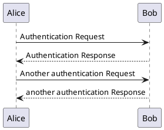
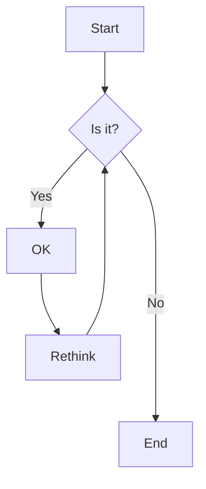
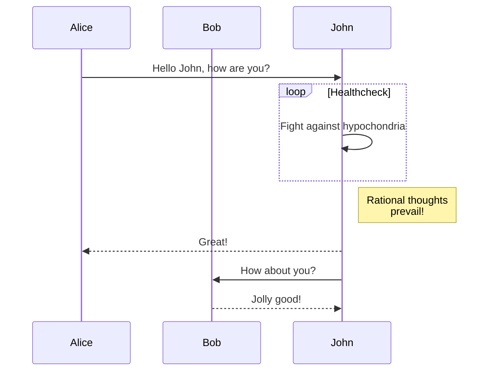

# PlantUMLとMermaidテスト

## PlantUMLの例



## Mermaidの例

### フローチャート



### シーケンス図



## 通常のMarkdown

これは通常のMarkdownテキストです。

- リスト項目1
- リスト項目2
- リスト項目3

### コードブロック

```python
def hello():
    print("Hello, World!")
```

終了。
